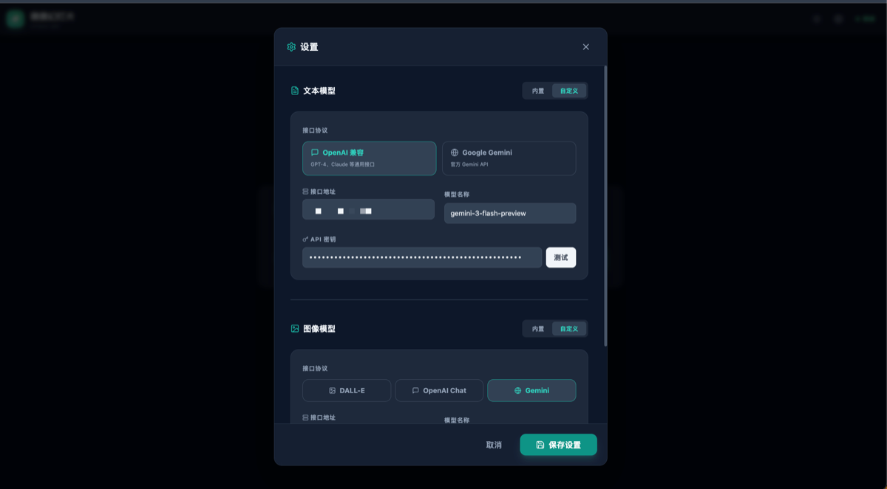

# 微微幻灯片 (unique-ppt)

[](https://opensource.org/licenses/MIT)
[](https://reactjs.org/)
[](https://vitejs.dev/)
[](https://tailwindcss.com/)

**AI 驱动的图文并茂 PPT 生成器** — 输入主题或文本，AI 自动生成大纲，并为每一页智能生成匹配内容的精美配图。

---

## 📸 预览

<p align="center">
  
  
</p>

<p align="center">
  
  
</p>

---

## ✨ 核心特性

| 特性            | 描述                                             |
| --------------- | ------------------------------------------------ |
| 🖼️ **智能配图** | 根据每页内容自动生成匹配的 AI 图片，真正图文并茂 |
| 🤖 **AI 编剧**  | 支持"主题"或"长文"模式，一键生成结构化大纲       |
| 🍱 **多种排版** | 封面、左右分割、磨砂玻璃、极简等多种精美布局     |
| 📄 **一键导出** | 标准 PPTX 格式，兼容 Office 与 Keynote           |
| 🌗 **深色模式** | 完美支持深色/浅色主题切换                        |
| ⚡ **并发生成** | 最多 5 张图片同时生成，速度提升 3-5 倍           |

---

## 🚀 快速开始

```bash
# 克隆项目
git clone https://github.com/uniqueww/unique-ppt.git
cd unique-ppt

# 安装依赖
npm install

# 启动开发服务器
npm run dev

# 构建生产版本
npm run build
```

访问 `http://localhost:5173` 开始使用。

---

## ⚙️ API 配置

点击右上角齿轮图标进入设置：

| 类型        | 支持的服务                     |
| ----------- | ------------------------------ |
| **文本 AI** | OpenAI (GPT-4) / Google Gemini |
| **图像 AI** | DALL-E 3 / Gemini / Imagen     |

> 💡 API 密钥仅存储在浏览器本地，不会上传到任何服务器。

---

## 🛠️ 技术栈

- **前端**: React 18 + Vite + Tailwind CSS
- **图标**: Lucide React
- **导出**: pptxgenjs
- **存储**: IndexedDB

---

## 📁 项目结构

```
src/
├── components/   # UI 组件
├── constants/    # 配置常量
├── hooks/        # 自定义 Hooks
├── services/     # API 调用
├── utils/        # 工具函数
└── App.jsx       # 主程序
```

---

## 📄 开源协议

[MIT License](LICENSE)

---

由 [uniqueww](https://github.com/uniqueww) 开发
